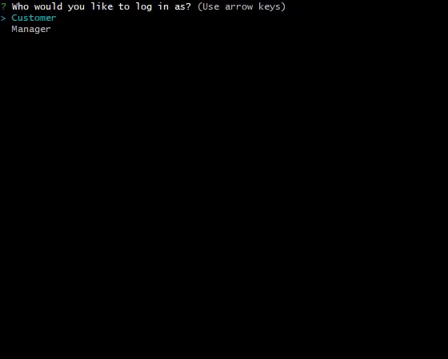

# Bamazon
### Bamazon is a retail store created with mySQL

To use the application install the files and run npm i to download the required node modules.

To launch the application type node index.js

Once the app is running it will ask if you would like to sign in as a customer or a manager.

As a customer you have the option of viewing and purchasing a product. After selecting the item index you would like to purchase and how many you would like to buy it will tell you the total of the purchase and update the database.

If the item you would like to purchase does not have enough inventory the application will let you know and close out.

As a manager you have a few options to choose from: 

- View Products available for sale
- View Products that have a low stock
- Restock Products
- Add a new Product
- View Department Sales

Viewing products available for sale will display a table similar to what a customer would see.

Viewing low inventory will display products who have a stock lower than 5.

When you restock a product, you need to select the item index that you would like to restock and the amount you would like to add.

When you add a product you will be asked to select the department the new product will go into, if the department doesn't exsist select **Add New Department**, you will then be prompted to name the product, the price, and how much stock you would initially like to have. 

When you view the department sales a table will display with each department, their overhead cost, a total of the sales made from products in that department and the calculated profit.

